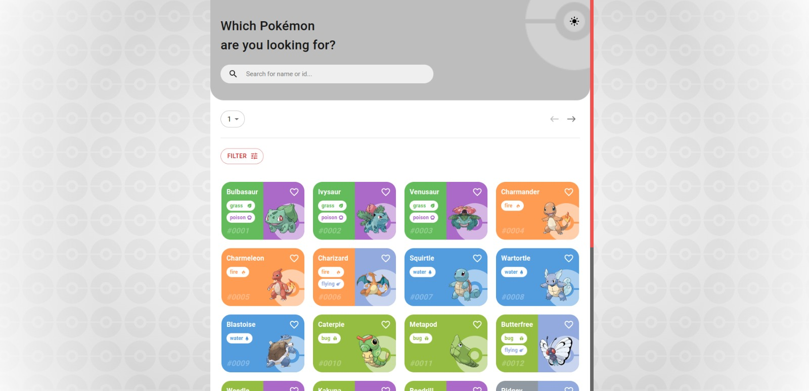
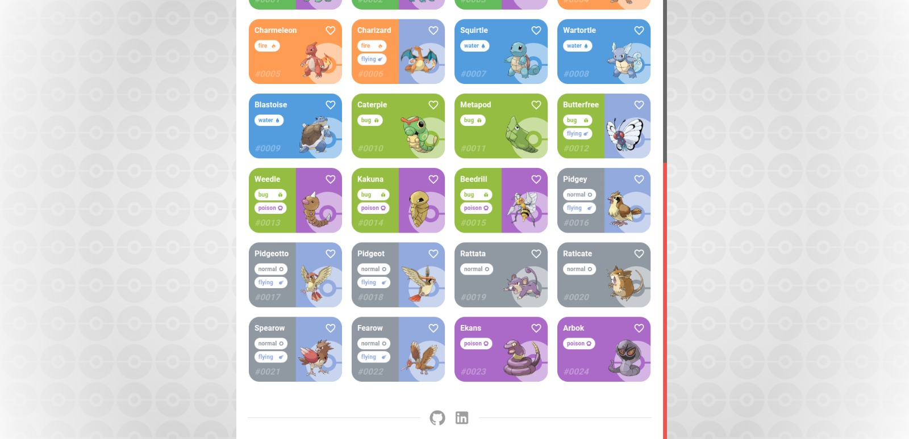
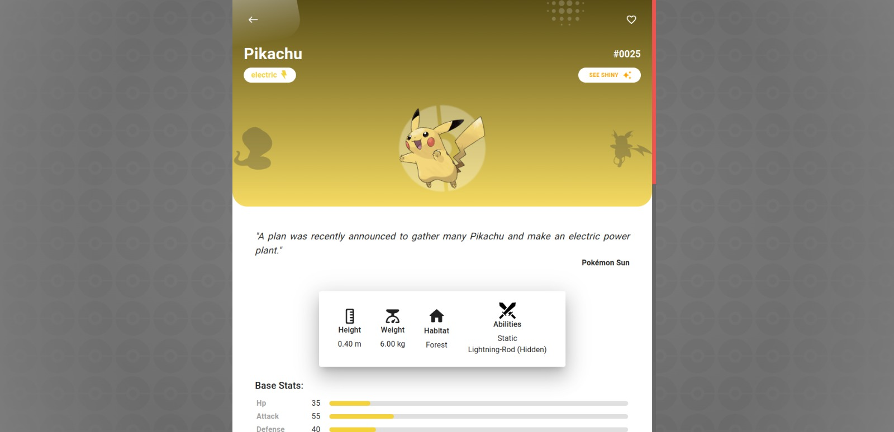
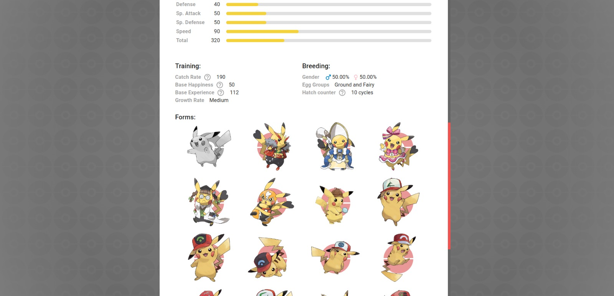

# Pokédex App

### Preview

## 🤔 About

The Pokédex App is a comprehensive tool designed to provide detailed information about various Pokémon. Leveraging the [PokéAPI](https://pokeapi.co/api/v2), this app allows users to search for and explore Pokémon by name or ID, view detailed stats and information, and manage a list of favorite Pokémon. For more technical details, refer to the [PokéAPI documentation](https://pokeapi.co/docs/v2).

## 💻 Technologies Used

- 
- 
- 
- 
- 
- 
- 

## 💡 Features

### Pokémons:

- List Pokémons from the API.
- Search for Pokémons by name or ID.
- Filter listed Pokémons by favorites, generation, and/or type.

### Pokémon Details:

- Switch between standard and shiny form.
- List detailed information about a Pokémon:
  - About
  - Base Stats
  - Training
  - Breeding
- List of alternative forms (if available)

### Favorites:

- Add Pokémon to the favorites list.
- Remove Pokémon from the favorites list.

### Themes:

- Switch between dark and light themes.

👾 Developed by [Jean Rafael Dresbach](https://www.linkedin.com/in/jean-rafael-dresbach/).
